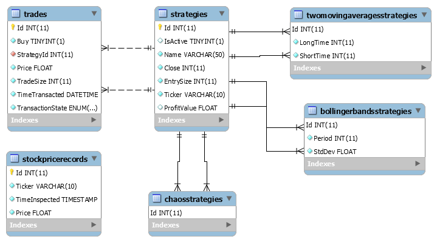
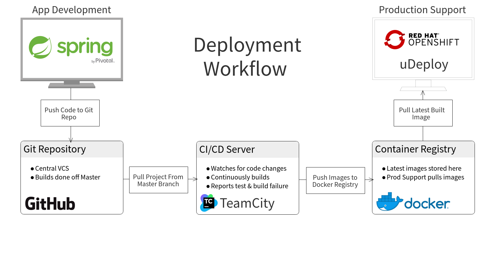

# SwiftTrading
### Chris Luo | Manan Singh | Jessica Zhang

## What is SwiftTrading?

Swift Trading is an automated stock trading platform designed for traders. Through our platform, traders can create automated-trading strategies, view their current strategies, monitor ongoing trading performed by active strategies, activate/deactivate strategies, and analyze the performance of specific strategies. Swift Trading currently has two stategy templates available: Two Moving Averages and Bollinger Bands. 

## Our Roles
#### Chris Luo
Chris is our back end engineer of our team. He implemented the REST API and handled the deployment process. 
#### Manan Singh
Manan is our back end engineer of our team. He implemented the trading execution engine of the platform. 
#### Jessica Zhang
Jessica is our front end engineer of our team. She created the UI of the platform. 

## Architecture
### Overall Architecture Diagram 

The front end is developed using Angular 5. 
The back end is developed in Java using Spring Boot and JMS.
### Database Diagram 

### Deployment workflow diagram

## General Setup Guide
### Running the app in development
Assuming the IDE that you're using is IntelliJ, you'll need to add an edit the run configurations on you app to include the line: `-Dspring.profiles.active=dev`

This will allow you to run the app in a development mode where you can configure the application.properties to have whatever values you'd like.

To setup the MySQL DB:
- Run the script to create the user in the SQL folder
- Next run the init.sql script
- Optoinally, you can now run the dummy data script if you would like to see mock data

To run the TradingEngine:
- Make sure the MySQL instance has been configuered properly and is running
- Simply run the project using maven or the IDE tools

To run the API:
- Make sure the TradingEngine has been running
- Simmply run the project using maven or the IDE tools

### Running the app in production
Please refer to the following resource for our deployment information: [Deployment Information](deployment_documentation/README.md).

## Our steps
1. Prior to coding, we designed the overall application flow and architecture of our project. We also interviewed the customer to confirm what the customer would want in our UI. 
2. We set up the overall project so we can start developing. We created an initial database diagram and set up a live feed to interact with our back end. 
3. We set up different roles and tasks and started developing our project. A lot of communication and team work was done to ensure that we knew what everyone was doing at all times and helped when there were problems. We communicated on how the UI should look like, how we should implement the strategies and what type of functions the REST API needs.  
4. We tested that our different project components (front end, REST API, and trade engine) were able to connect properly.
5. Once a prototype was done, a customer interview was set up in order to ensure that the customer liked what he/she was seeing.
6. When our development project was fully working, we refactored our code and created some unit tests. 
7. We prepared to ship our project from development to production. 

## Retrospective
During this project, there were things that went well/wrong. We figured out what we would change and what we learned from this project.
### Some of the things that went well:
- Good planning of overall architecture prior to initial development
- Strong team communication
- REST API and database was finished quickly
- Very deliverable focused
- Good usage of git
### Some of the things that went wrong:
- Had difficulties shipping our project from development to production due to technical difficulties
- Spent too much time on low priority tasks
- Had difficulties with angular components interacting with one another 
### What we would change:
- Be willing to ask for help from others more frequently 
- Have a better understanding of how the strategies run
- Make the initial directory structure clearer
- Would change our DB to be a cluster over a single instance
- Keep price records in an in-memory cache (Redis or memcached) instead of our MySQL Database
### Lessons learned:
- Never assume facts on the subject material
- Exchanging ideas and information with other teams helped us debug quicker
