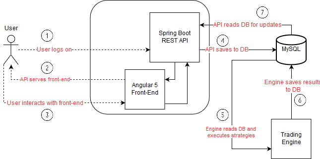

# SwiftTrading
### Chris Luo | Manan Singh | Jessica Zhang

## What is SwiftTrading?

Swift Trading is an automated stock trading platform designed for traders. Through our platform, traders can create automated-trading strategies, view their current strategies, monitor ongoing trading performed by active strategies, de-activate or reactive strategies and analyze the performance of specific strategies. Swift Trading currently has two stategy templates avaialble; Two Moving Averages and Bollinger Bands. 

## Our Roles
#### Chris Luo
Chris is our back end engineer of our team. He implemented the rest API so the UI and trading execution can talk to the database. He is also in charge of transitioning our project from development into production. 
#### Manan Singh
Manan is our back end engineer of our team. He implemeneted the trading execution of the platform. 
#### Jessica Zhang
Jessica is our front end engineer of our team. She created the wireframes and the UI of the platform. 

## Architecture
### Overall Architecture Diagram 

The front end is developed using Angular 5. 
The back end is developed in Java using Spring Boot and JMS.
### Database Diagram 
[Insert database diagram here]
### Deployment workflow diagram
[insert deployment workflow diagram here]

## General Setup Guide
### Running the app in development
[How to run the app]
### Running the app in production
[How to run the app]

## Directory Structure
[Directory Structure]

## Our steps
1. Prior to coding, we designed the overall architecture of the diagram. We figured out what the best arhictecture should be to create a solution to the problem. We also interviewed the customer to confirm what the customer would want in our UI. 
2. We set up the overall project so we can start developing. We created an initial database diagram, set up a live feed to interact with our back end and integrated our front end framework with the rest API. 
3. We set up different roles and tasks and started developing our project. A lot of communication and team work was done to ensure that we knew what everyone was doing at all times and helped when there were problems. We communicated on how the UI should look like, how we should implement the strategies and what type of functions the rest API needs.  
4. Once a prototype was done, a customer interview was set up in order to ensure that the customer liked what he/she was seeing. 
5. When our development project was fully working, we refactored our code and created some unit tests. 
6. We prepared to ship our project from development to production. 

## Retrospective
During this project, there were things that went well/wrong. We figured out what we would change and what we learned from this project.
### Some of the things that went well:
- Thought of overall architecture prior to initial development
- team communication was strong
- rest API and database was finished quickly
- very deliverable focused
- Good usage of git 
### Some of the things that went wrong:
- Had difficulties shipping our project from development to production due to technical difficulties
- Spent too much time on low priority tasks
- Had difficulties with angular components interacting with one another 
### What we would change:
- Everyone should have basic knowledge of docker. 
- Have a better understanding of how the stratgies run
- Make the initial directory structure clearer
### Lessons learned:
- Never assume facts on the subject material
- Exchanging ideas and information with other teams helped us debug quicker
## References
[Insert wireframes here]
[Outside material we thought was useful]
